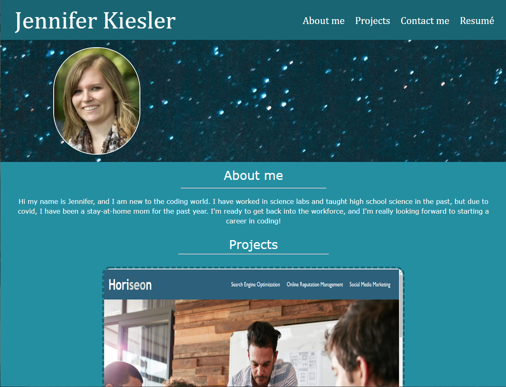

# Professional Portfolio

## Description
This portfolio showcases my skills and talents by showing my best work for future employers. 

This portfolio satisfies a typical hiring manager's needs like:
- The developer's name, a recent photo or avatar, and links to sections about me, my work, and how to contact me is presented.
- The links in the navigation scrolls to the corresponding section.
- The section with my work has titled images of my applications.
- The first application's image is larger in size than the others.
- If you click on an application's image, you will be taken to that deployed application.
- The portfolio has a responsive layout that adapts to the viewport.

## Visuals

## Deployed Link

https://jenniferkiesler.github.io/professional-portfolio/